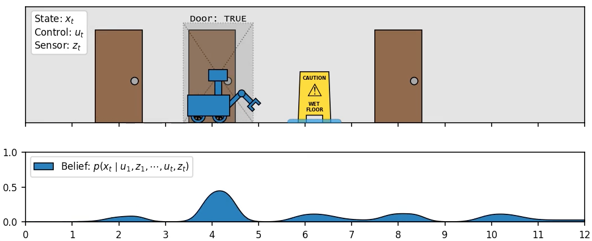

# Estimation-and-Control

📌 *Python reference implementations of standard estimation and control algorithms - built with JAX for performant vector processing and auto-differentiation.*

<p align="center">
  
  <br/>  
  <sub><i>Bayesian state-estimation in a simple simulated environment. 
  [<a href="https://russ-stuff.com/robotics/the-bayes-filter-for-robotic-state-estimation/">link</a>]</i></sub>  

</p>

## Overview

This repository provides clean, well-documented Python implementations of commonly used tate estimation and control algorithms. It is designed for students and engineers who want reliable reference implementations that are:

 1. Readable
 2. Generic
 3. Performant

in roughly that order of importance.

> ⚡ JAX support enables auto-differentiation, allowing for the user to model nonlinear systems without manually deriving symbolic Jacobians.


## Table of Contents

 - [System Modeling](#system-modeling)
 - [Filters](#filters)
   - Kalman Filter
   - Extended Kalman Filter
   - Unscented Kalman Filter
   - Histogram Filter
   - Particle Filter
 - [Controllers](#controllers)
   - (coming soon 🚧)
 - [Quickstart](#🚀-quickstart)
 - [Installation](#installation)
 - [License](#license)


## System Modeling
A general framework is provided for modeling dynamical systems, including measurement models and non-determinism. Certain filters/controllers are only compatible with certain types of system models.
```
                   +------------------+
                   |   SystemModel    |
                   |------------------|
                   | * f(x,u)         |  <-- dynamics
                   | * h(x)           |  <-- measurement
                   +------------------+
                             |
         +-------------------+-------------------+
         |                                       |
         v                                       v
+-----------------------+          +---------------------------+
|  GaussianSystemModel  |          | DifferentiableSystemModel |
|  (adds noise models)  |          |      (Jacobian API)       |
|-----------------------|          |---------------------------|
| * Q (process cov)     |          | * jacobian_f(x,u)         |
| * R (measurement cov) |          | * jacobian_h(x)           |
+-----------------------+          +---------------------------+
         |                                      |
         |                                      |
         |    +---------------------------------+---------------------------+
         |    |                                 |                           |
         v    v                                 v                           v
+----------------------+           +-------------------------+   +-----------------------+
|  LinearSystemModel   |           |  AutoDiffSystemModel    |   |  SymbDiffSystemModel  |
| (concrete, analytic) |           | (JAX / autograd)        |   | (user-provided jac)   |
|----------------------|           |-------------------------|   |-----------------------|
| A, B, C matrices,    |           | Wraps f,h but uses      |   | Wraps f,h but uses    |
| implements jacobians |           | auto-diff for jacobians |   | symbolic jacobians    |
| * f(x,u) = Ax + Bu   |           | * jax.np operations     |   | * explicit jacobian_f |
| * h(x) = Cx          |           | * JIT compilation       |   | * explicit jacobian_h |
+----------------------+           +-------------------------+   +-----------------------+

```

## Filters

The [Bayes Filter](https://russ-stuff.com/robotics/the-bayes-filter-for-robotic-state-estimation/) forms the basis of all online probabilistic state estimation, with a variety of implementations suitable for different types of systems. This repository includes implementations of:

 - **Kalman Filter (KF)**: Optimal for linear Gaussian systems with Gaussian belief model
 - **Extended Kalman Filter (EKF)**: Handles nonlinear dynamics via first-order approximation
 - **Unscented Kalman Filter (UKF)**: Sigma-point approach for better nonlinear performance
 - **Histogram Filter**: General filter that models belief explicitly as a dense histogram over the state space
 - **Particle Filter**: General filter that models belief implicitly as a sparse cloud of points


## Controllers

Controllers are a work-in-progress 🚧. Support is planned for:

 - Proportional-Integral-Derivative (PID)
 - Linear Quadratic Regulator (LQR)
 - Model Predictive Control (MPC)
 - Nonlinear control methods


## 🚀 Quickstart

Example usage:
```python
# Define a linear double-integrator system
from estimation_and_control.systems import LinearSystemModel

dt = 0.1

A = np.array([ [1, dt],
               [0, 1 ] ])

B = np.array([ [0.5 * dt**2],
               [dt         ] ])

C = np.array([ [1, 0] ])

accel_variance = 0.01
R = B @ B.T * accel_variance

measurement_variance = 0.3
Q = np.array([[measurement_variance]])

double_integrator = LinearSystemModel(A, B, C, R, Q)


# Run a Kalman filter
from estimation_and_control.filters.filters import KalmanFilter

car_KF = KalmanFilter(double_integrator)

# initialize the filter belief
car_KF.initialize(initial_mean, initial_covariance)

# filter a timestep, followed by a measurement
car_KF.predict_step(x, u)
car_KF.update_step(z)        # fully independent

# read off the currnt state estimate
print(car_KF.mean, car_KF.covariance)
```

For a more, see the [NonLinearKinematicCar](examples/NonLinearKinematicCar/nonlinear_car_estimation_EKF.ipynb) example.

## Installation

```bash
git clone https://github.com/rschwa6308/Estimation-and-Control.git
cd Estimation-and-Control
```

Install dependencies (including JAX)
```bash
pip install -r requirements.txt
```

Install `estimation-and-control`
```bash
pip install -e .
```

## License
This project is licensed under the [MIT License](LICENSE) © 2025 [Russell Schwartz].
